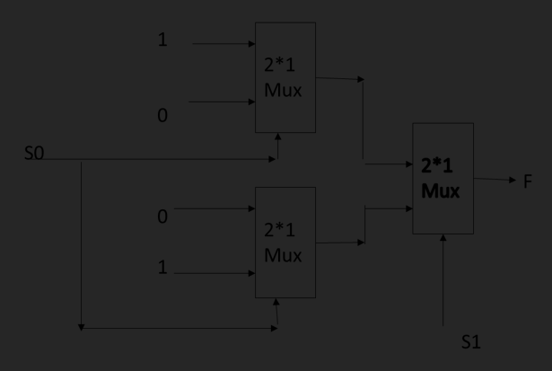
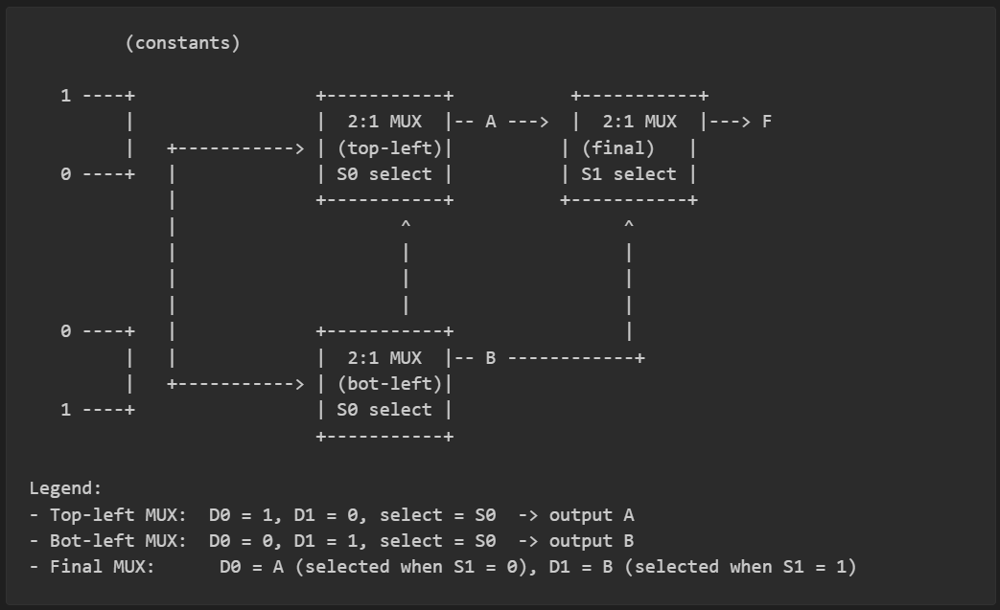
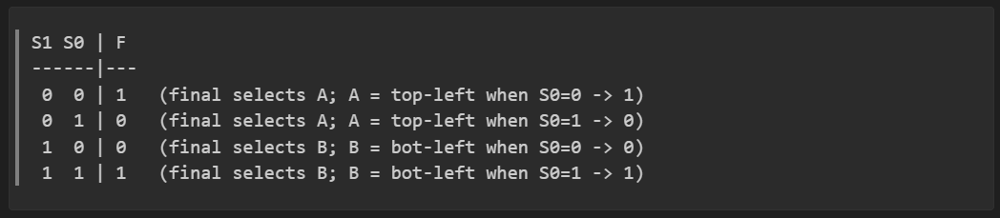
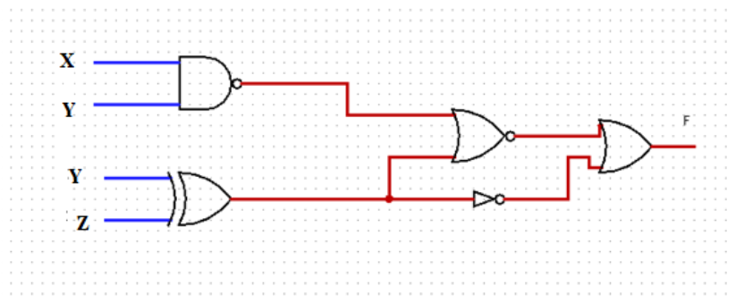

# Computer Systems and Logic Exercises III
_Originally created 24 December, 2020 by Maxwell Hauser — Updated 4 October, 2025_

1. Simplify following functions in the form of sum of products and product of sums:
    
    >a) F(W, X, Y, Z) = ∑(0, 1, 2, 8, 10, 15)

    >b) F(W, X, Y, Z) = ∑(6, 7, 9, 14)

    >c) F(X, Y, Z) = ∑(0, 1, 3, 7)

    >d) F(X, Y, Z) = XY’Z’ + X’Z’ + Y’Z + X’Y’Z’

<br>

2. Implement the following function using one or more multiplexers:
    
    >a) F(W, X, Y, Z) = ∑(0, 1, 3, 4, 7, 9, 10, 14, 15)

<br>

3. The following truth table is given:
    
    ```
    | X | Y | Z || F |
    |---|---|---||---|
    | 0 | 0 | 0 || 0 |
    | 0 | 0 | 1 || 1 |
    | 0 | 1 | 0 || 1 |
    | 0 | 1 | 1 || 0 |
    | 1 | 0 | 0 || 1 |
    | 1 | 0 | 1 || 1 |
    | 1 | 1 | 0 || 1 |
    | 1 | 1 | 1 || 0 |
    ```
    > a) Find function F in form of sum of minterms.

    > b) Use k-map to simply function F.

    > c) Draw logic circuit for function F.

<br>

4. Implement the following functions using one decoder and external gates.

    >a) F1(X, Y, Z) = X’Z’ + X’Y’

    >b) F2(X, Y, Z) = X’Y’Z + XZ’ + XY

<br>

5. Design a combinational circuit with three inputs, X, Y, Z, and one output, F. The output is one if the input is divisible by 2, otherwise the output is zero.

    >a) Show truth table

    >b) Find output function using K-map

    >c) Draw logic circuit

<br>

6. The following multiplexer is given. Find the output value for the given select lines.

    > 

    <br>

    Below is an ASCII reproduction of the multiplexer network shown in the image above. This is a two-level network of 2:1 multiplexers: two left-side 2:1 MUXes (both selected by S0) feed a final right-side 2:1 MUX (selected by S1).

    > 

    <br>
    
    Truth table for select lines (S1 S0 -> F):
    
    > 

    <br>

    Observation: F = 1 exactly when S1 and S0 are equal, so F = XNOR(S1, S0).

<br>

7. The following logic circuit is given:
    
    > 

    <br>

    >a) Find output function
    
    >b) Simplify output function
    
    >c) Show truth table for the function

<br>

8. Consider the following function:
    
    > F(X, Y, Z) = X’YZ + Y’Z + XZ’

    Draw logic circuit for the function using only:
    
    >a) NAND gates
    
    >b) NOR gates

<br>

9. Design a 2 bit ALU to perform the following functions:
    ```
    S1 S0           Function
    0  0............A OR B
    0  1............B’
    1  0............A AND B
    1  1............A PLUS B
    ```
   
    >a) Use 2:1 multiplexers to select the desired function.

    >b) Show truth table, K-map and logic circuit.
