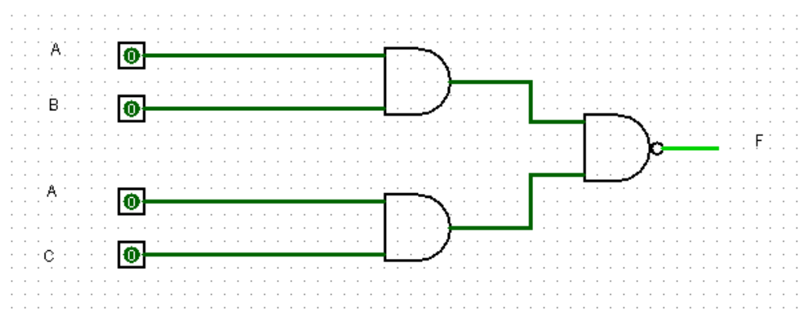

Lab #2:   Learning to construct a Combinational Logic Circuit using Logicsim
The objective of this lab is to learn how to build a combinational logic circuit using Logicsim
Implement the circuit shown in Figure 2 and complete the following truth table.

Figure 2: Combinational Logic Circuit

Truth Table
ic

Truth Table for Figure 2:
```
| A | B | C || F |
|---|---|---||---|
| 0 | 0 | 0 || 1 |
| 0 | 0 | 1 || 1 |
| 0 | 1 | 0 || 1 |
| 0 | 1 | 1 || 1 |
| 1 | 0 | 0 || 1 |
| 1 | 0 | 1 || 1 |
| 1 | 1 | 0 || 1 |
| 1 | 1 | 1 || 0 |
```


2. Find the output function and show truth table   for following combinational logic
Figure 3: Combinational Logic Circuit
```
       |------|
X -----|      |     |----|
       | NAND |-----|    |
Y -----|      |     |    |
       |------|     |    |
                    | OR |----- F
       |------|     |    |
X -----|      |     |    |
       | NOR  |-----|    |
Z -----|      |     |    |
       |------|     |----|
```
Truth Table for Figure 3:
```
| X | Y | Z || F |
|---|---|---||---|
| 0 | 0 | 0 || 1 |
| 0 | 0 | 1 || 1 |
| 0 | 1 | 0 || 1 |
| 0 | 1 | 1 || 0 |
| 1 | 0 | 0 || 1 |
| 1 | 0 | 1 || 1 |
| 1 | 1 | 0 || 0 |
| 1 | 1 | 1 || 0 |
```

Output function: F = (X NAND Y) + (X NOR Z)

