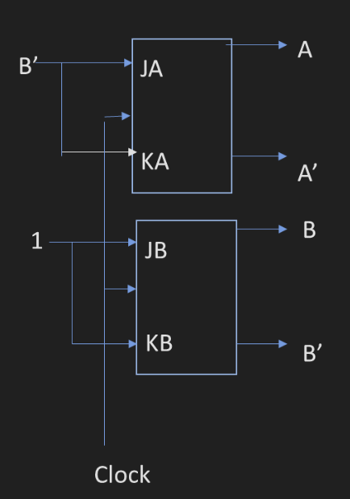

A J-K Flip is a type of flip-flop that has two inputs, J and K, and two outputs, Q and Q'. The next state of the flip-flop is determined by the current state and the inputs J and K, as well as the clock pulse (C). The behavior of the J-K Flip-Flop can be summarized in the following table:

| J | K | C | Q (Next State) | Q' (Next State) | Desc |
|---|---|---|----------------|-----------------|------|
| 0 | 0 | ↑ |      Q         |       Q'       | Hold |
| 0 | 1 | ↑ |      0         |       1        | Reset|
| 1 | 0 | ↑ |      1         |       0        | Set |
| 1 | 1 | ↑ |     Q'         |       Q        | Toggle|

Where ↑ indicates a rising edge of the clock pulse.

This means, when the clock pulse transitions from 0 to 1 (rising edge), the next state of the flip-flop, Q, is determined by the values of J and K according to the table above.

Let's look at an example of each case:
```
J = 0
K = 0
C = 0
Q = 0
Q' = 1
```

### Case 1: Hold (J = 0, K = 0)
```
Clock pulse is low, so the state remains unchanged.
When the clock pulse goes high (C = 1), the state still remains unchanged (Hold) at Q = 0 and Q' = 1 because J = 0 and K = 0.

If the initial state was Q = 1 and Q' = 0, it remains Q = 1 and Q' = 0.
```

### Case 2: Reset (J = 0, K = 1)
```
J = 0, K = 1, C = 0
Clock pulse is low, so the state remains unchanged.
When the clock pulse goes high (C = 1), the state changes to Q = 0 and Q' = 1 (Reset) because J = 0 and K = 1.

If the initial state was Q = 1 and Q' = 0, it changes to Q = 0 and Q' = 1.
```

### Case 3: Set (J = 1, K = 0)
```
J = 1, K = 0, C = 0
Clock pulse is low, so the state remains unchanged.
When the clock pulse goes high (C = 1), the state changes to Q = 1 and Q' = 0 (Set) because J = 1 and K = 0.

If the initial state was Q = 0 and Q' = 1, it changes to Q = 1 and Q' = 0.
```

### Case 4: Toggle (J = 1, K = 1)
```
J = 1, K = 1, C = 0
Clock pulse is low, so the state remains unchanged.
When the clock pulse goes high (C = 1), the state changes to Q = 0 and Q' = 1 (Toggle) because J = 1 and K = 1.

If the initial state was Q = 0 and Q' = 1, it changes to Q = 1 and Q' = 0.
If the initial state was Q = 1 and Q' = 0, it changes to Q = 0 and Q' = 1.
```

Let's analyze the behavior of the following J-K Flip-Flop step by step based on the inputs given, with the initial state Q = 0 and Q' = 1.

Complete the table, where $↑$ simply indicates the clock pulse rising edge ticking the flip-flop.

### J-K Diagram
```
       |-------|
J----->|       |----->Q  
C----->|       |
K----->|       |----->Q'
       |-------|
```

### Truth Table for J-K Flip-Flop with Clock Pulses

| J | K | C | Q (Next State) | Q' (Next State) |
|---|---|---|----------------|-----------------|
| 0 | 0 | ↑ |        0       |        1        |
| 1 | 0 | ↑ |        1       |        0        |
| 1 | 1 | ↑ |        0       |        1        |
| 1 | 1 | ↑ |        1       |        0        |
| 0 | 1 | ↑ |        0       |        1        |
| 0 | 0 | ↑ |        0       |        1        |

The following Register is given, show final value after shifting 3 times to right

`101` &rarr; `01110000`

`10` &rarr; `10111000`

`1` &rarr; `01011100`

 &rarr; `10101110`

The following Register is given, show final value after shifting 4 times to left

`01110000` &larr; `1101`

`11100001` &larr; `101`

`11000011` &larr; `10`

`10000110` &larr; `1`

`00001101`  &larr;

4. Design a counter to count: 
    $0$ &rarr; $1$ &rarr; $2$ &rarr; $4$ &rarr; $3$ &rarr; $5$ &rarr; $6$ &rarr; $7$ and repeat using J-K Flip Flops.


5. The following state table is given, where AB is the current state and X is the input. Find the corresponding state diagram:


| AB | X = 0 | X = 1 |
|----|-------|-------|
| 00 |   11  |  01   |
| 01 |   00  |  10   |
| 10 |   01  |  11   |
| 11 |   10  |  00   |


---

6. Find state table for the following figure 


JA, KA, and JB, KB are inputs to J-K Flip Flops A and B respectively.

---
Assembly language is a low-level programming language that is specific to a computer architecture. It uses mnemonic codes and labels to represent machine-level code, making it easier for humans to read and write.
In assembly, the destination register is always the first operand.

Consider the following arithmetical operations in assembly:

- MOV = Move (to register)
- ADD = Add
- SUB = Subtract
- MUL = Multiply
- DIV = Divide

And the following bitwise operations:

- AND = Bitwise AND
- ORR = Bitwise OR
- COM = Compare (subtracts two values but does not store the result, only updates the flags)
- ADDGT = Add if Greater Than
- SUBLTE = Subtract if Less Than or Equal.

Trace the following instructions:

MOV R1, 0x45 &rarr; move the value 0x45 (01000101) to R1 (register 1)

MOV R2, 0x87 &rarr; move 0x87 (10000111) to R2

ADD R2, R1, 0x77 &rarr; R2 = R1 + 0x77 = 01000101 + 01110111 = 10111100

AND R3, R1, R2 &rarr; R3 = 00000101

AND stores in R3 only the bits that are 1 in both R1 and R2.

ORR R4, R1, R2 &rarr; R4 = 10111100

ORR stores in R4 the bits that are 1 in either R1 or R2.

---
Trace the following instructions and find the values in R3 and R4:
```
MOV R1, #0x30     
MOV R2, #0x40
COM R2, R1
```
R2 - R1 = 0x10 (R2 > R1)
```
ADDGT R3, R2, R1
```
R3 = 0x70. Execute ADDGT because R2 > R1
```
SUBLTE R4, R2, R1
```
R4 = 0x00. Do not execute SUBLTE because R2 > R1

Trace the following instructions and find the values in R3 and R4:
```
MOV R1, #0x50     
MOV R2, #0x40
COM R2, R1
```
R2 - R1 = -0x10 (R2 < R1)
```
ADDGT R3, R2, R1
```
R3 = 0x00. ADDGT not executed because R2 < R1.
```
SUBLTE R4, R2, R1
```
R4 = -0x10. SUBLTE executed because R2 < R1.
