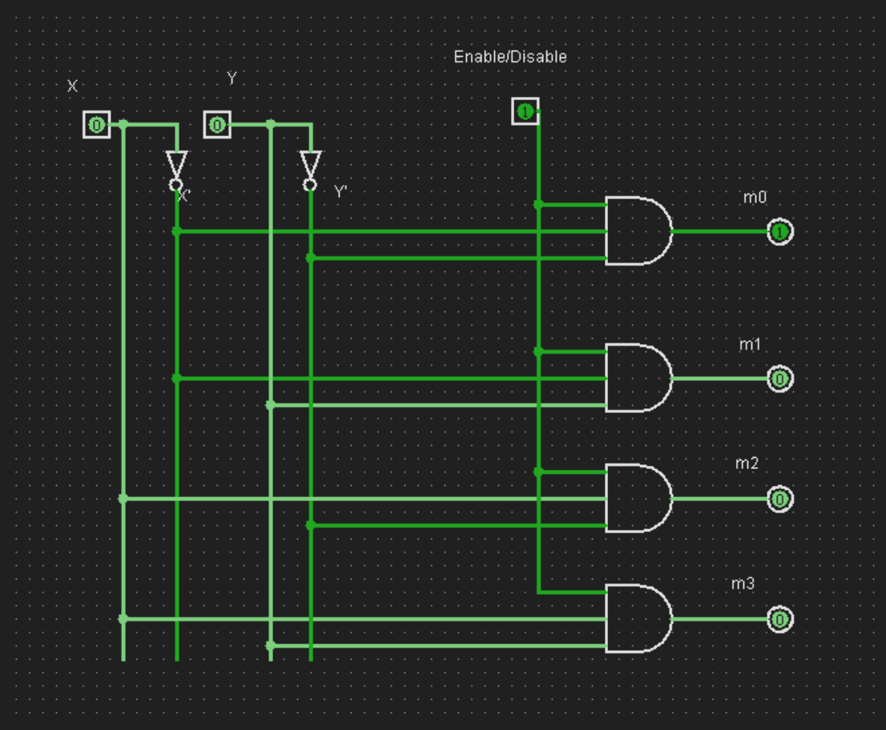

decoder

The objective of this exercise is to understand the operation of a Decoder.

intro/overview/background

definitions

information


The function of a decoder is to generate minterms for the  inputs.  Figure 5 shows the block diagram of a 2 x 4 decoder with 4 minterms. 

```
       |-------|
X----->|  2X4  |----->X'Y'  
       |  DCDR |----->X'Y
Y----->|       |----->XY'
       |-------|----->XY
```
> Block diagram of a 2x4 decoder.

Figure 6 shows a 2 x 4 decoder with E/D (Enable/Disable).  Show the operation of the decoder and complete the following truth table.




| E/D | X Y | m0 | m1 | m2 | m3 |
|-----|-----|----|----|----|----|
|  0  | D D | 0  | 0  | 0  | 0  |
|  1  | 0 0 | 1  | 0  | 0  | 0  |
|  1  | 0 1 | 0  | 1  | 0  | 0  |
|  1  | 1 0 | 0  | 0  | 1  | 0  |
|  1  | 1 1 | 0  | 0  | 0  | 1  |

D = don't care

lesson

applications

limitations

summary/conclusion

exercises/exmples